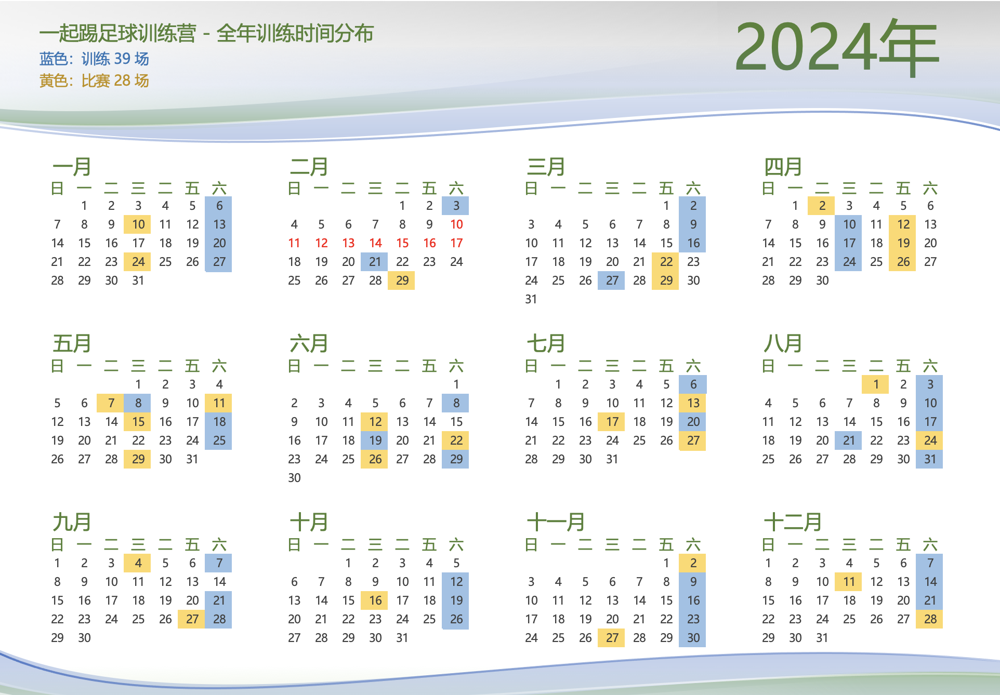

# 如何加入训练？

训练营的目标是锻炼身体力量和足球运动技能，增强个人自信和责任，建立团队合作和人际关系。把对足球的喜欢当成单纯专业的运动爱好。

## 参加训练要求

- 球鞋根据场地合理选择 AG/TF 鞋钉
- 根据场地选择是否带水，备少量食物
- 最好年满 16 岁或以上，有保护自身安全能力
- 费用根据球场不同 AA
- 不聚餐，纯互助性质

## 训练内容安排

组织者应提前确定训练场地、教练、训练时间和训练内容。

- 15 分钟热身
- 25 分钟技术训练
- 25 分钟技能训练
- 30 分钟主题训练
- 30 分钟分组比赛

## 会员权益

- 优先参加全年超 30 场训练
- 优先参加 11 人制或 8 人制比赛
- 非营利性质，更多详情见会员礼包

## 时间地点

### 深圳南山西丽训练营

- 西丽 onetwo 松坪山足球场（白沙物流园 1 栋天台）
- 选择 TF 足球鞋
- 每周一次训练，周六 20:30-22:30
- 场地费 AA，非会员可按单次收费加入训练
- 报名通过微信“大志有球“小程序，可关注活动更新
- 加入会员咨询 awong1900（王队微信）

### 深圳坂田训练营（试运营）

- 坂田 OASIS 绿洲运动社区（天台）
- 选择 TF 足球鞋
- 每周一次训练，周三 20:30-22:30
- 场地费 AA，非会员可按单次收费加入训练
- 报名通过微信“大志有球“小程序，可关注活动更新
- 加入会员咨询 awong1900（王队微信）

### ~~深圳福田福保训练营（不定期）~~

为满足福田区域的球友，增加一个新的训练地点，欢迎大家参与。

## 会员费

训练营采用非盈利模式运营，做到收支平衡，大家可以支持或赞助我们。

### 购买会员礼包

#### A0-会员支持礼包（线上）：支持 100 元

1. 获得 1 年线上会员资格
2. 获得或保留专属球衣号
3. 进入会员群，获得在线指导
4. 续费按老会员价格

#### A1-会员标准礼包（1 年）：支持 500 元（老会员续费 400 元）

5. 获得 1 年的会员资格
6. 优先参与全年超 30 场的团队训练，含教练费，只需分摊场地费
7. 优先参加 11 人制、 8 人制等友谊赛
8. 获得南山杯、深圳杯等正式比赛报名资格

#### A2-会员标准礼包（半年）：支持 350 元（老会员续费 300 元）

1. 获得半年的会员资格
2. 优先参与半年超 15 场的团队训练，含教练费，只需分摊场地费
3. 优先参加 11 人制、 8 人制等友谊赛
4. 获得南山杯、深圳杯等正式比赛报名资格

#### C-赞助支持礼包：支持 5000 元

1. 获得各种赞助商权益

## 2024 年全年活动日历

全年组织训练 39 场，比赛 28 场。其中参加深圳南山杯 11 人制比赛，大宝路甲级联赛，8 场 11 人制友谊赛，8 人制冠军赛等。

以上供大家参考。
