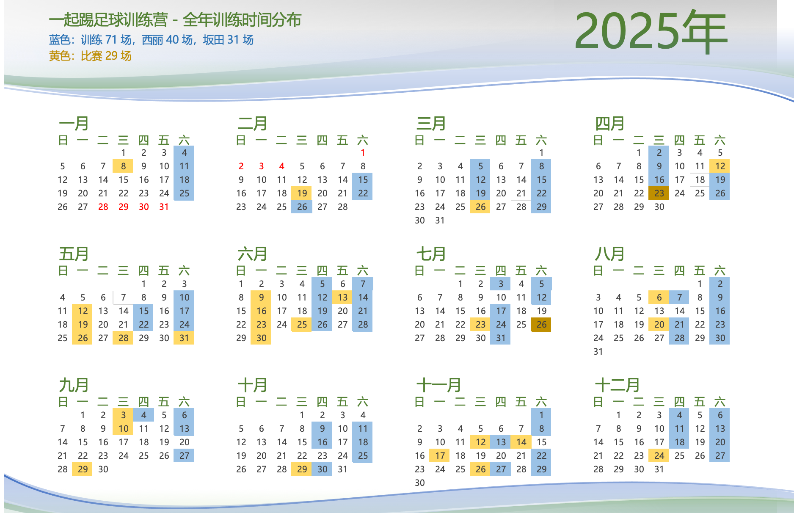

# 如何加入训练？

训练营的目标是锻炼身体力量和足球运动技能，增强个人自信和责任，建立团队合作和人际关系。把对足球的喜欢当成单纯专业的运动爱好。

## 参加训练要求

- 球鞋根据场地合理选择 AG/TF 鞋钉
- 根据场地选择是否带水，备少量食物
- 年满 16 岁或以上，有保护自身安全能力
- 费用根据球场不同 AA

## 训练内容安排

组织者应提前确定训练场地、教练、训练时间和训练内容。

- 15 分钟热身
- 25 分钟技术训练
- 25 分钟技能训练
- 30 分钟主题训练
- 30 分钟分组比赛

## 时间地点

### 深圳南山西丽训练营

- Onetwo 足球场（大学城店）
- 选择 TF 足球鞋
- 隔周一次训练，周六 20:30-22:30
- 训练咨询 awong1900（王队微信）

### 深圳龙华坂田训练营

- 坂田 OASIS 绿洲运动社区（天台）
- 选择 TF 足球鞋
- 每周一次训练，周四 20:30-22:30
- 训练咨询 OYZ921027（欧阳队长微信）

## 会员权益和费用

### 权益对比一览表

| 权益项目           | 🌟 认证会员 (A1/A2 礼包)                                        | 🏃 非会员 (单次体验)     |
| ------------------ | --------------------------------------------------------------- | ------------------------ |
| **训练报名优先级** | **最高优先**（锁定位额，全年超 30 场）                          | 仅在有空余名额时开放报名 |
| **正式比赛资格**   | **优先参加** 11 人制/8 人制友谊赛及官方联赛（南山杯、新安杯等） | 仅在有空余名额时开放报名 |
| **专属球衣号**     | **保留专属球衣号码**                                            | 无专属号码               |
| **专业教练指导**   | **已包含**在会费中，无需额外支付                                | **已包含**在单次费用中   |
| **费用分摊方式**   | **仅需分摊场地费（AA）**                                        | 按单次综合费用结算       |
| **社群与技术交流** | 进入**专属会员群**，享受在线指导                                | 仅限常规活动通知群       |

### 购买会员礼包

训练营采用非营利模式运营，做到收支平衡，大家可以支持或赞助我们。

#### A1-会员标准礼包（1 年）：支持 500 元

5. 获得 1 年的会员资格
6. 优先参与全年超 30 场的团队训练，含教练费，只需分摊场地费
7. 优先参加 11 人制、 8 人制等友谊赛
8. 获得南山杯、新安杯等正式比赛报名资格

#### A2-会员标准礼包（半年）：支持 350 元

1. 获得半年的会员资格
2. 优先参与半年超 15 场的团队训练，含教练费，只需分摊场地费
3. 优先参加 11 人制、 8 人制等友谊赛
4. 获得南山杯、深圳杯等正式比赛报名资格

#### C-赞助支持礼包：支持 5000 元

1. 获得各种赞助商权益

## 2025 年全年活动日历

全年组织训练 71 场，其中西丽 40 场，坂田 31 场。比赛 29 场。其中参加深圳南山杯 11 人制比赛; 新安联赛 8 人制比赛; 新安杯 8 人制比赛并进入 8 强; 友谊赛 11 人制 14 场。

以上供大家参考。更多[财报信息](./finance)
